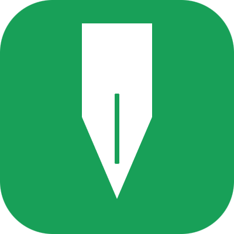

<h1 align="center">影迹</h1>
<h6 align="center">Shadow Diary</h6>

<p align="center">
  
</p>

A local-first diary desktop app built with Electron + Vue 3 + TypeScript.

[中文](README_CN.md) | English

## Features

- **Diary Writing**
  - Rich text editor with image support
  - Entry metadata management (title, mood, tags)
- **Dashboard & Insights**
  - Calendar-based writing prompts
  - Statistics and trend views
- **Archive System**
  - Manage person/object/other archives
  - Alias-aware search expansion
- **Media Library**
  - Unified media browsing from diaries and archives
- **Global Search**
  - `Ctrl/Cmd + K` quick search
  - Combined filters by keyword, mood, tags, date range, and archive data
- **Privacy & Security**
  - App lock (6-digit PIN / Windows sign-in password)
  - Auto-lock on idle and system lock linkage
  - Encrypted SQLite database (SQLCipher)
  - Optional disguise mode for privacy-sensitive scenarios
- **Data Import & Export**
  - One-click ZIP backup and restore
  - Password-protected backup flow
- **Auto Update**
  - Check, download, and install updates via `electron-updater`
- **Internationalization**

## Tech Stack

- Electron + electron-vite
- Vue 3 + TypeScript + Pinia + Vue Router
- Naive UI + ECharts
- better-sqlite3-multiple-ciphers (SQLCipher)
- sharp (image processing)
- electron-builder (packaging)

## Project Structure

```text
src/
  main/                    # Electron main process
    database/              # Data access and migrations
    privacy/               # Disguise mode and privacy sessions
    security/              # Local key management
    utils/                 # Image storage, backup import/export, helpers
  preload/                 # Safe APIs exposed via contextBridge
  renderer/src/            # Vue frontend
    components/            # Shared UI components
    views/                 # Pages: dashboard/today/archives/media/settings
    stores/                # Pinia stores
    i18n/                  # Locale definitions and i18n bootstrap
resources/                 # Icons and static packaging assets
```

## Quick Start

### Requirements

- Node.js `>= 22` (22 LTS recommended)
- npm (latest version compatible with your Node.js)

### Install Dependencies

```bash
npm install
```

### Development

```bash
npm run dev
```

### Preview Build

```bash
npm run start
```

## Scripts

```bash
# Code quality
npm run lint
npm run format
npm run typecheck

# Build
npm run build
npm run build:unpack
npm run build:win
npm run build:win:msi
npm run build:win:all
npm run build:mac
npm run build:linux

# Release (GitHub Releases)
npm run release
```

## Data & Security Notes

- App data is stored under Electron `app.getPath('userData')`.
- Key files and folders include:
  - `diary.db`: encrypted database (SQLCipher)
  - `images/`, `thumbnails/`: image assets and thumbnails
  - `db-key.json`: local DB key file (encrypted via Electron `safeStorage`)
- Exported backups are ZIP packages containing database, attachments, metadata, and encrypted key envelope.
- Backup password minimum length is 8 characters.

## Packaging & Installation

### Multi-platform Packaging

```bash
npm run build:win
npm run build:mac
npm run build:linux
```

### Silent Install on Windows

```bash
# NSIS
ShadowDiary-<version>-<os>-<arch>-setup.exe /s

# MSI
msiexec /i ShadowDiary-<version>-<os>-<arch>.msi /qn
```

## License

[MIT](LICENSE)
