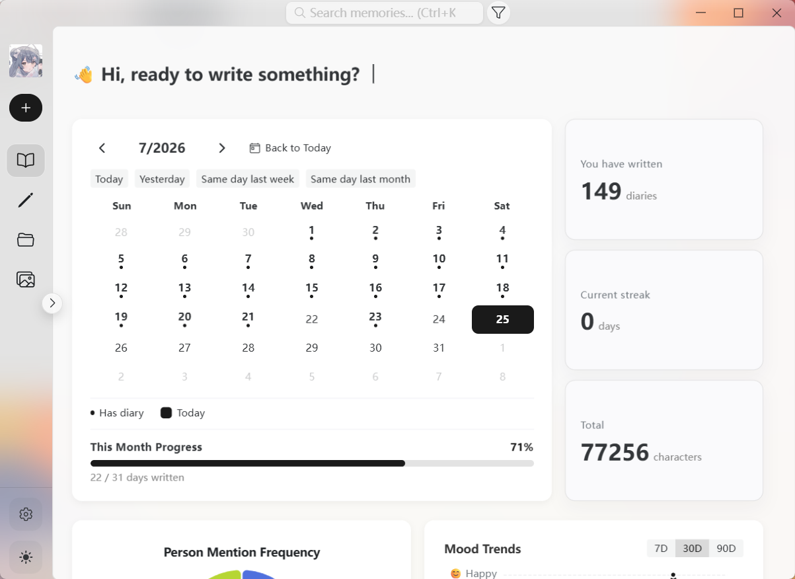
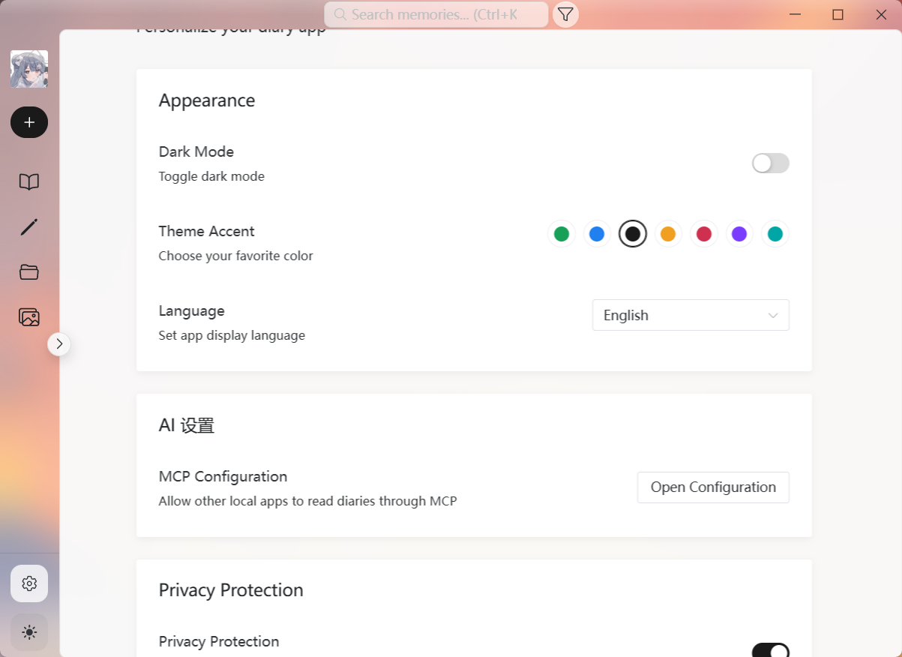
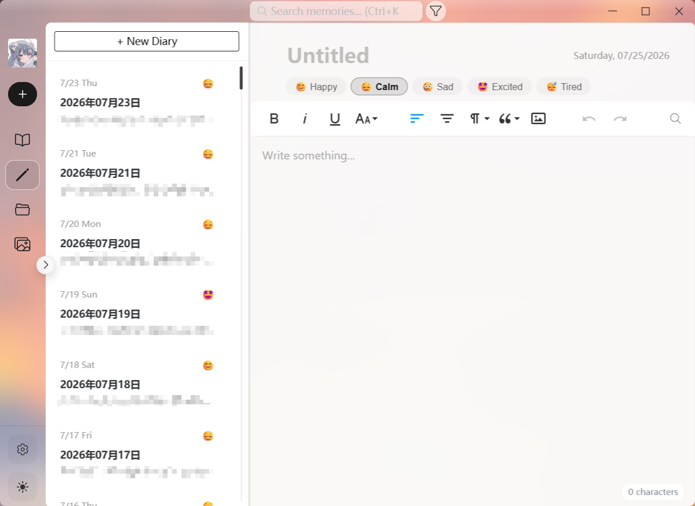
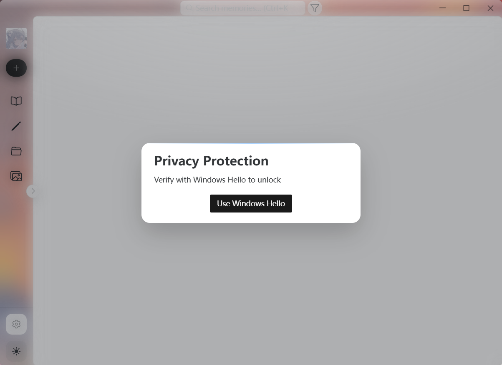

<h1 align="center">影迹</h1>
<h6 align="center">Shadow Diary</h6>

<p align="center">
  
</p>

Shadow Diary is a local-first desktop diary application built with Electron, Vue 3, TypeScript, and an encrypted SQLite data store.

[中文](README_CN.md) | English

## Display





## Overview

Shadow Diary keeps the main application data on the local machine and uses Electron as the boundary between system capabilities and the Vue renderer. The main process owns persistence, filesystem access, image processing, app updates, import/export, Windows Hello verification, and the optional local MCP server. The renderer focuses on the user experience: writing, search, dashboards, archive management, media browsing, settings, privacy lock state, and internationalization.

## Core Features

- Rich text diary editor with image insertion, paste, drag-and-drop, search, and replace.
- Diary metadata including title, mood, tags, weather, creation time, and update time.
- Dashboard with calendar activity, writing statistics, mood distribution, and person mention insights.
- Archive system for people, objects, and other records, including aliases and image galleries.
- Global search across diary text, metadata, tags, date ranges, and archive aliases.
- Media library built from image references in diary entries and archive records.
- Privacy controls with PIN or Windows Hello unlock, idle lock, system-lock integration, and disguise mode.
- Local encrypted database using `better-sqlite3-multiple-ciphers`.
- ZIP-based data import and export for database, images, thumbnails, attachments, and metadata.
- Optional local MCP endpoint for controlled diary search/read access by external tools.
- Multi-language UI: Simplified Chinese, English, Japanese, and Korean.
- Auto-update flow through `electron-updater`.

## Architecture

```text
Electron App
├─ Main process
│  ├─ BrowserWindow lifecycle, navigation policy, updater, IPC registration
│  ├─ SQLite/SQLCipher database initialization and migrations
│  ├─ Diary, archive, tag, attachment, media, settings, and stats services
│  ├─ Image storage, thumbnail generation, and custom diary-image:// protocol
│  ├─ Data import/export orchestration
│  ├─ SafeStorage-backed local secrets
│  ├─ Disguise-mode data/session handling
│  ├─ Optional local MCP HTTP server
│  └─ Windows Hello helper process integration
├─ Preload
│  └─ Typed `window.api` bridge backed by IPC
└─ Renderer
   ├─ Vue application shell, router, layout, and pages
   ├─ Pinia stores for user, theme, privacy, disguise, locale, startup, and AI settings
   ├─ Rich text editor, diary list, archive components, media lightbox, and settings views
   └─ i18n locale bundles
```

## Source Layout

```text
src/
  main/
    index.ts                 # Electron app bootstrap, window, IPC, updater, protocol handling
    database/                # SQLCipher connection, migrations, repositories, search indexes
    mcp/                     # Local MCP server and tool registration
    privacy/                 # Disguise mode session and seed data
    security/                # SafeStorage helpers and database key handling
    utils/                   # Images, attachments, path checks, import/export helpers
  preload/
    index.ts                 # contextBridge API exposed to the renderer
    index.d.ts               # Renderer-side window typing
  renderer/src/
    App.vue                  # App shell, privacy lock, sidebar/header layout
    main.ts                  # Vue, Pinia, router, i18n bootstrap
    router/                  # Hash-router page map
    components/              # Shared UI components
    views/                   # Dashboard, today, archives, media, settings
    stores/                  # Pinia state modules
    i18n/                    # Locale setup and language packs
  native/
    ShadowDiary.WindowsHello # .NET helper for Windows Hello support and verification
  types/
    api.ts                   # IPC API contracts
    model.ts                 # Shared domain models
resources/                   # Installer resources and app assets
build/                       # Icons and platform packaging resources
```

## Data Model

The application database is created and migrated by `src/main/database/migrations.ts`. Current domain areas include:

- `diary_entries`: rich HTML content, plain-text content, mood, timestamps, and metadata.
- `tags` / `diary_tags`: many-to-many diary tagging.
- `attachments`: file metadata linked to diary entries.
- `settings`: user, privacy, locale, theme, AI, and MCP preferences.
- `archives`: person/object/other records with aliases and images.
- `image_refs`: reference counts for stored diary images.
- `person_mention_stats`: cached mention counts for archive people.
- `media_source_refs`: normalized media-library index across diaries and archives.

Search combines indexed diary text, structured filters, tags, and archive alias expansion. Media browsing uses source-reference rows so one image can point back to one or more diary/archive contexts.

## Runtime Data

Runtime data is stored under Electron `app.getPath('userData')`.

Common files and folders:

- `diary.db`: encrypted SQLite database.
- `db-key.json`: local database key material stored through Electron `safeStorage`.
- `images/`: stored full-size WebP images.
- `thumbnails/`: generated WebP previews.
- `attachments/`: copied attachment files.

Diary images are referenced in content with the custom `diary-image://` protocol and resolved by the main process.

## MCP Integration

The optional MCP server is configured from the AI/MCP settings screen and listens on `127.0.0.1`. It exposes controlled tools for:

- Searching diary entries.
- Reading diary text by id or date range.
- Fetching diary metadata in batches.
- Searching archive records by name or alias.

The runtime implementation is in `src/main/mcp/server.ts`, with request validation handled through `zod`.

## Windows Hello Helper

Windows Hello support is implemented as a small .NET helper project at `src/native/ShadowDiary.WindowsHello`. The Electron main process launches it for support checks and verification requests. Windows release builds run:

```bash
npm run build:windows-hello-helper
```

The compiled helper is packaged through `electron-builder.yml` as an extra resource.

## Tech Stack

- Electron 39 + electron-vite
- Vue 3 + TypeScript
- Pinia + Vue Router
- Naive UI + Ionicons
- Froala Editor
- ECharts + vue-echarts
- better-sqlite3-multiple-ciphers
- sharp
- @modelcontextprotocol/sdk
- electron-updater
- electron-builder
- .NET Windows helper for Windows Hello

## Requirements

- Node.js `>= 22`
- npm
- .NET SDK for Windows builds that include the Windows Hello helper

## Development

Install dependencies:

```bash
npm install
```

Native modules used by Electron, Sharp, SQLite, and the build toolchain are OS-specific. Windows and WSL/Linux can share the source tree and `package-lock.json`, but must not share one `node_modules` directory. Run `npm ci` separately in a Windows working directory and a Linux working directory; use `npm run build:win` on Windows and `npm run build:linux` on Linux.

Run the desktop app in development mode:

```bash
npm run dev
```

Preview the built app:

```bash
npm run start
```

## Scripts

```bash
# Code quality
npm run lint
npm run format
npm run typecheck

# Build renderer/main/preload bundles
npm run build

# Package variants
npm run build:unpack
npm run build:win
npm run build:win:msi
npm run build:win:all
npm run build:mac
npm run build:linux

# Windows Hello helper
npm run build:windows-hello-helper

# GitHub release publishing
npm run release
```

## Packaging

Packaging is configured in `electron-builder.yml`.

- Windows: NSIS and MSI targets.
- macOS: DMG and ZIP targets.
- Linux: AppImage and DEB targets.
- `asarUnpack` includes native `.node` modules.
- `build/windows-hello-helper` is copied as an extra resource for Windows packages.

Example Windows silent install commands:

```bash
# NSIS
ShadowDiary-<version>-<os>-<arch>-setup.exe /s

# MSI
msiexec /i ShadowDiary-<version>-<os>-<arch>.msi /qn
```

## License

[MIT](LICENSE)
